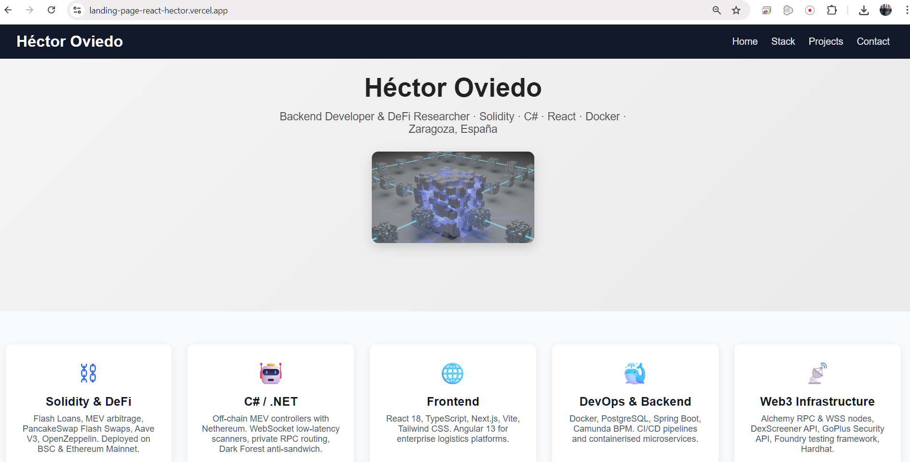

<div align="center">

# 🚀 landing-page-react-hector


**🌐 [landing-page-react-hector.vercel.app](https://landing-page-react-hector.vercel.app)**

*Portfolio personal — React + TypeScript + Vite · Deployed on Vercel.*

</div>

---

## 📝 Descripción

Portfolio personal construido con **React + TypeScript + Vite** — presenta stack técnico, proyectos destacados y experiencia profesional en DeFi, backend y frontend. Desplegado en producción en Vercel con CI/CD automático.

---

## 🖼️ Preview



---

## 🧩 Secciones

| Sección | Componente | Contenido |
|:---|:---|:---|
| Hero | `HeroSection` | Presentación + imagen blockchain |
| Stack | `FeaturesGrid` | Solidity · C# · React · DevOps · Web3 · GameDev |
| Proyectos | `FeaturesGrid` | DeFi-MEV-Ecosystem · SniperBot · LogicSolution · más |
| Highlights | `TestimonialsSection` | MEV · WebSocket · Dark Forest · Full-Stack |
| Contacto | `PricingSection` | GitHub · LinkedIn · Vercel live site |
| Footer | `Footer` | Links sociales · 2026 |

---

## 🛠️ Tech Stack

| Área | Tecnología |
|:---|:---|
| Framework | React 18 |
| Lenguaje | TypeScript + JavaScript |
| Build tool | Vite |
| Estilos | CSS3 |
| Deploy | Vercel (CD automático) |
| Linting | ESLint |

---

## 🏗️ Estructura del Proyecto
```
landing-page-react-hector/
├── src/
│   ├── assets/
│   │   └── img/              # Imágenes y assets
│   ├── components/
│   │   ├── Navbar.jsx
│   │   ├── HeroSection.jsx
│   │   ├── FeaturesGrid.jsx
│   │   ├── FeatureCard.jsx
│   │   ├── PricingSection.jsx
│   │   ├── PricingCard.jsx
│   │   ├── TestimonialsSection.jsx
│   │   ├── TestimonialCard.jsx
│   │   └── Footer.jsx
│   ├── data/
│   │   ├── featuresData.js       # Stack técnico
│   │   ├── featuresDataPricing.js # Links de contacto
│   │   └── featuresDataT.js      # Tech highlights
│   └── App.jsx
├── index.html
└── vite.config.js
```

---

## 🚀 Instalación y Ejecución
```bash
git clone https://github.com/HEO-80/landing-page-react-hector.git
cd landing-page-react-hector
npm install
npm run dev
```

Abre [http://localhost:5173](http://localhost:5173) en tu navegador.

**Build de producción:**
```bash
npm run build
npm run preview
```

---

## 🌐 Demo en vivo

👉 **[landing-page-react-hector.vercel.app](https://landing-page-react-hector.vercel.app)**

Desplegado en Vercel con CD automático — cada push a `main` actualiza la producción.

---

## 🔗 Proyectos destacados en el portfolio

| Proyecto | Descripción |
|:---|:---|
| [DeFi-MEV-Ecosystem](https://github.com/HEO-80/DeFi-MEV-Ecosystem) | ⚡ Flash Loans · MEV arbitrage · BSC Mainnet |
| [12_MultiTokenBrain](https://github.com/HEO-80/12_MultiTokenBrain) | 🐺 WebSocket MEV radar · Dark Forest routing |
| [monitoring-stack](https://github.com/HEO-80/monitoring-stack) | 🐳 Prometheus · Grafana · Docker |
| [LogicSolutionFrontend](https://github.com/HEO-80/LogicSolutionFrontend) | 🗺 Angular 13 · Google Maps logistics |

---

## 🧑‍💻 Autor

**Héctor Oviedo** — Backend Developer & DeFi Researcher

[](https://www.linkedin.com/in/hectorob/)
[](https://github.com/HEO-80)

---

<div align="center">
  <sub>Built with ⚡ Vite · Deployed on Vercel · <strong>Héctor Oviedo</strong> · Zaragoza, España</sub>
</div>
